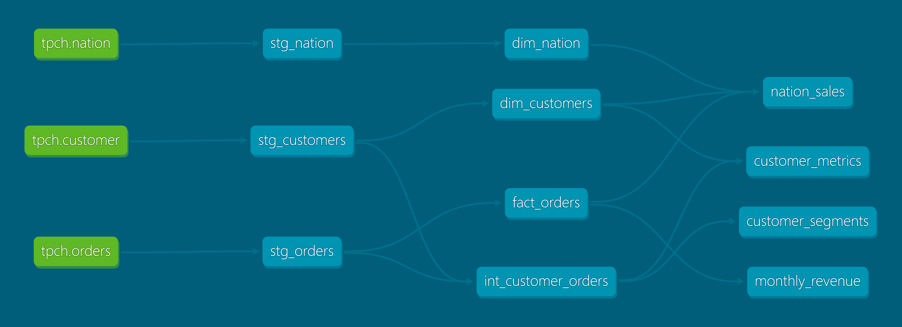

# Data Engineering Demo — Modern Data Stack with dbt & Snowflake

An end-to-end analytics engineering project built on **dbt Core** and **Snowflake**, following a layered (staging → intermediate → marts) architecture with a star-schema data model, source definitions, data quality tests, layer-based materialization, and CI on GitHub Actions.

Built hands-on to model a modern ELT pipeline from raw source data to analysis-ready marts.

---

## Lineage

Interactive, always-current lineage graph — auto-generated and deployed via GitHub Actions on every push:

**https://deniz-erol.github.io/data-engineer-playground/#!/overview?g_v=1**



---

## Stack

| Layer | Tool |
|---|---|
| Data warehouse | Snowflake |
| Transformation / modeling | dbt Core (SQL) |
| Source data | Snowflake `SNOWFLAKE_SAMPLE_DATA` (TPCH_SF1 — ~1.5M orders) |
| CI | GitHub Actions |
| Version control | Git / GitHub |

---

## Architecture

Classic **ELT**: raw data is **loaded** into the warehouse, then **transformed** in place with dbt.

```
SNOWFLAKE_SAMPLE_DATA (raw TPCH: customer, orders, nation)
        │  (dbt sources)
        ▼
   staging      →  stg_customers, stg_orders, stg_nation      (cleaning, renamed columns) [views]
        │
        ▼
 intermediate   →  int_customer_orders                         (joins + aggregation)      [view]
        │
        ▼
    marts        →  dim_customers, fact_orders                 (star schema)              [tables]
                    monthly_revenue, customer_metrics, nation_sales   (business marts)    [tables]
        │
        ▼
   BI / analytics (Power BI, Snowsight, ...)
```

**Why layered:** each layer has one responsibility — staging standardizes raw data, intermediate applies business logic, marts serve analysis-ready tables. This mirrors software layering (separation of concerns) and keeps transformations testable and maintainable. Simple marts read directly from staging; the intermediate layer is used only where transformation logic is complex enough to be worth splitting.

---

## Data model (star schema)

- **`fact_orders`** — one row per order; numeric measures (`total_price`) plus a foreign key (`customer_id`) to the customer dimension. ~1.5M rows.
- **`dim_customers`** — descriptive customer attributes (name, market segment, nation, account balance). ~150K rows.

Analytical questions are answered by joining the fact to its dimensions, filtering on dimension attributes, and aggregating the fact.

---

## Marts (business-facing tables)

| Mart | What it answers |
|---|---|
| `monthly_revenue` | Revenue, order count and average order value per month (time-series) |
| `customer_metrics` | Per-customer order count, total spend, lifetime span, and spending rank (window function) |
| `nation_sales` | Revenue and order metrics by country (geographic breakdown) |
| `int_customer_orders` | Customer-level order summary (intermediate building block) |

---

## Layers & models

```
models/
├── staging/
│   ├── _tpch_sources.yml      # raw source definitions (customer, orders, nation)
│   ├── _staging.yml           # tests + documentation
│   ├── stg_customers.sql
│   ├── stg_orders.sql
│   └── stg_nation.sql
├── intermediate/
│   ├── _intermediate.yml
│   └── int_customer_orders.sql
└── marts/
    ├── _marts.yml             # tests + documentation
    ├── dim_customers.sql
    ├── fact_orders.sql
    ├── monthly_revenue.sql
    ├── customer_metrics.sql
    └── nation_sales.sql
```

**Materialization strategy** (in `dbt_project.yml`, overridden per-model where needed):
- `staging` / `intermediate` → **views** (lightweight, always fresh)
- `marts` → **tables** (frequently queried, materialized for performance)
- `fact_orders` → **incremental** (merge strategy on `order_id`) — at ~1.5M rows, only new orders are processed on each run instead of a full rebuild, using `is_incremental()` and a watermark on `order_date`. The `unique_key` makes reruns idempotent.

**Sources:** raw TPCH tables are declared in `_tpch_sources.yml` and referenced with `{{ source(...) }}` rather than hard-coded paths — enabling lineage and centralized source management.

---

## Data quality tests

Defined in the `_*.yml` files, run with `dbt test`. Generic tests on every model across all layers, including:

| Test | Purpose |
|---|---|
| `unique`, `not_null` on primary keys | key integrity (customers, orders) |
| `relationships` (fact → dim, orders → customers) | referential integrity between fact and dimension |
| `unique` on `spending_rank`, `nation_name` | correctness of aggregations / window ranks |

All tests pass — the `relationships` tests in particular guarantee no orphan records between fact and dimensions.

---

## CI

A GitHub Actions workflow (`.github/workflows/ci.yml`) runs on every push and pull request to `main`:
it installs dbt, connects to Snowflake using credentials stored in **GitHub Secrets**, and runs `dbt build` (models + tests). A red check blocks broken changes from being merged.

> A production setup would add a CD step deploying to a separate prod Snowflake target on merge; here dev and prod are the same environment, so only CI is wired up.

---

## Running the project

```bash
# 1. create & activate a virtual environment
python -m venv venv
.\venv\Scripts\Activate.ps1        # Windows PowerShell

# 2. install dbt with the Snowflake adapter
pip install dbt-snowflake

# 3. from the tbi_demo/ project directory:
dbt debug      # verify the Snowflake connection
dbt run        # build all models
dbt test       # run data quality tests
dbt docs generate && dbt docs serve   # browse docs + lineage
```

Connection settings live in `~/.dbt/profiles.yml` (Snowflake account, warehouse, database, role). Credentials are never committed.

---

## Notes

- Built with dbt Core 1.12 and the Snowflake adapter.
- Source data is Snowflake's built-in TPCH sample dataset, so the project runs on any Snowflake trial account with no data loading required.
- Structured to reflect real-world analytics engineering practices: source-driven staging, layered modeling, dimensional marts, tested and version-controlled transformations, and CI.